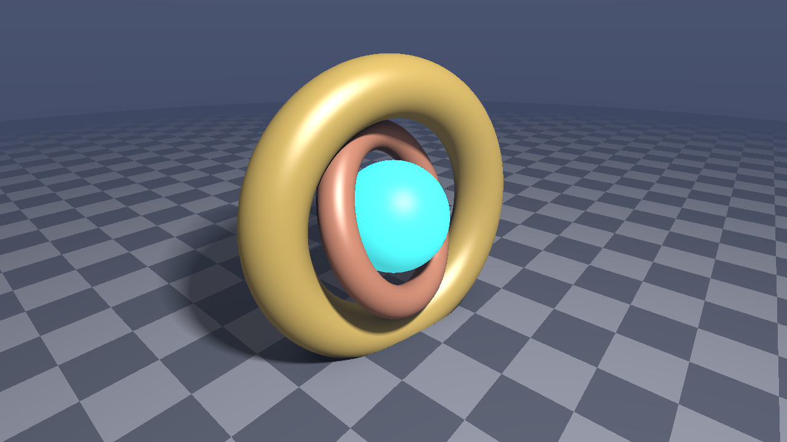
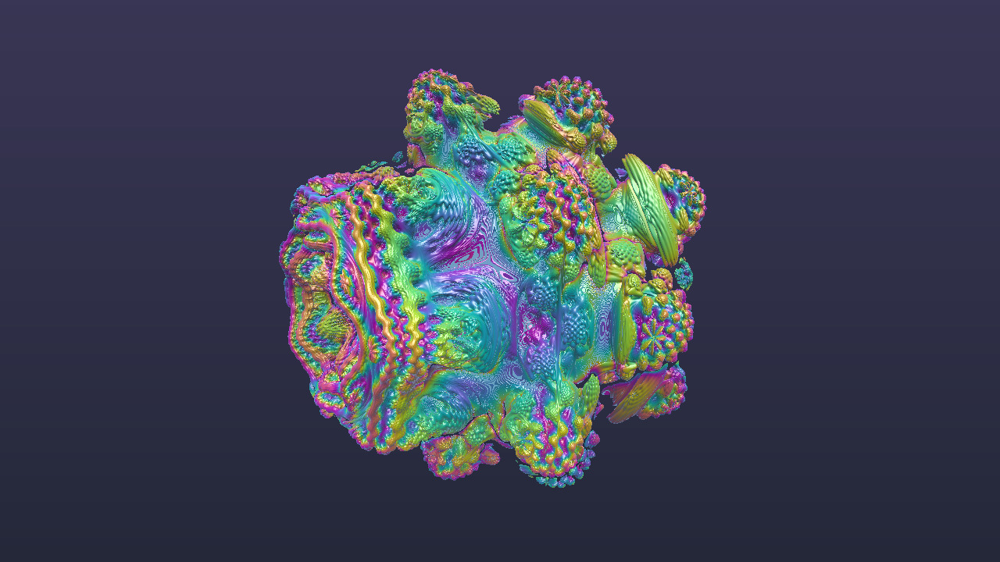
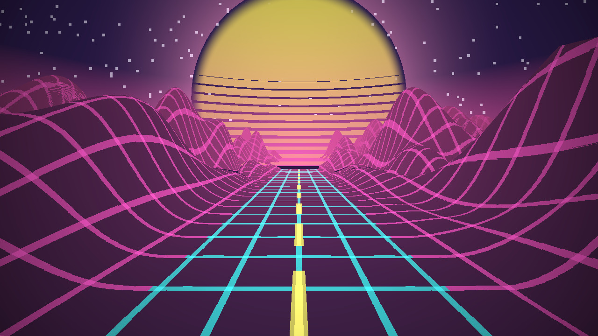
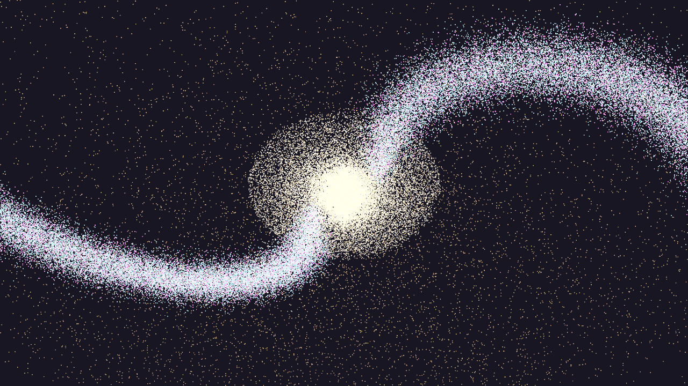

# High-Performance CUDA Programming in LuaJIT

This project implements a pure **LuaJIT + CUDA** framework that allows you to write, dynamically compile, and execute GPU CUDA kernels directly from Lua without any external C/C++ compilation steps (`nvcc`) or wrapper libraries.

---

## 🌟 Why is LuaJIT + CUDA so Powerful?

1. **Zero-Overhead FFI**: LuaJIT’s Foreign Function Interface (FFI) compiles C function calls directly into machine code, having near-zero overhead (sub-microsecond execution per launch).
2. **On-the-Fly Runtime Compilation (NVRTC)**: NVIDIA’s Runtime Compilation library (`libnvrtc.so`) lets Lua compile CUDA C/C++ source strings straight to GPU binary PTX code at runtime.
3. **No Build Steps**: You can write CUDA C/C++ kernels right inside your Lua code like a scripting language, yet execute at raw GPU hardware speed (TFLOPS).
4. **Interactive Rapid Prototyping**: Change a shader equation or math kernel in Lua and run it instantly!

---

## 🚀 Programs Included

### 🎮 `menu.lua`: Interactive TUI Demo Launcher
Launch and explore all CUDA GPU demos from an interactive terminal dashboard:
```bash
./menu.lua
```
- **Navigation**: Use <kbd>↑</kbd> / <kbd>↓</kbd> or <kbd>j</kbd> / <kbd>k</kbd>
- **Launch**: Press <kbd>Enter</kbd> or direct select with number keys <kbd>1</kbd>–<kbd>6</kbd>
- **Exit to Menu**: Press <kbd>Ctrl</kbd>+<kbd>C</kbd> in any running demo to return cleanly back to the menu!
- **Quit**: Press <kbd>q</kbd>

---

### 1. `raymarch_demo.lua`: Real-Time 3D Raymarching Engine
A complete 3D Signed Distance Field (SDF) raymarcher running on the GPU and streaming **24-bit RGB TrueColor** directly to your terminal using Unicode half-blocks (`▀`):
- **Features**:
  - Complex 3D scene: rotating gold torus, copper inner ring, pulsing neon cyan plasma core, and orbiting satellite.
  - Finite-difference surface normal estimation.
  - Blinn-Phong specular reflections, diffuse lighting, soft shadows, ambient occlusion, and distance fog.
  - Dynamic terminal auto-resizing via `ioctl`.
  - High-res snapshot export to PPM/JPEG.
- **Run in Terminal**:
  ```bash
  ./raymarch_demo.lua
  # Or with custom options:
  ./raymarch_demo.lua --fps 60 --size 120x60
  ```
- **Export High-Res Render (e.g. 1920x1080)**:
  ```bash
  ./raymarch_demo.lua --size 1920x1080 --save render.ppm
  ```

<p align="center">
  
</p>

---

### 2. `mandelbulb3d.lua`: 3D Mandelbulb Fractal Raymarcher
Renders the famous White & Nylander **3D Mandelbulb fractal** ($v^N + c$) entirely on the GPU:
- **Features**:
  - Full spherical coordinate distance estimator with trigonometric power expansion.
  - Orbit-trap iridescent coloring (electric gold, cyan, magenta, and deep violet).
  - Dynamic power morphing from $N=4$ to $N=8$, or fixed power via `--power 8.0`.
  - Rim lighting, ambient occlusion, and 3D camera orbiting.
- **Run in Terminal**:
  ```bash
  ./mandelbulb3d.lua
  # Or with fixed power 8.0:
  ./mandelbulb3d.lua --power 8.0
  ```
- **Export High-Res Render (e.g. 1920x1080)**:
  ```bash
  ./mandelbulb3d.lua --size 1920x1080 --save mandelbulb.ppm
  ```

<p align="center">
  
</p>

---

### 3. `synthwave3d.lua`: 80s Cyberpunk / Outrun Infinite Landscape
An iconic 80s Retrowave / Synthwave endless flight simulation:
- **Features**:
  - Infinite glowing wireframe highway speeding forward with dashed lane lines.
  - Multi-octave procedural mountain ranges on both sides.
  - Giant glowing sunset on the horizon with horizontal blinds.
  - Twinkling stars in the night sky and atmospheric neon pink haze.
- **Run in Terminal**:
  ```bash
  ./synthwave3d.lua
  # Speed up flight:
  ./synthwave3d.lua --speed 1.5
  ```
- **Export Desktop Wallpaper**:
  ```bash
  ./synthwave3d.lua --size 1920x1080 --save synthwave.ppm
  ```

<p align="center">
  
</p>

---

### 4. `galaxy3d.lua`: 100,000+ Star 3D Spiral Galaxy Simulator
Simulates and renders a realistic 3D spiral galaxy with 120,000+ stars entirely on the GPU:
- **Features**:
  - Realistic Vera Rubin flat galactic rotation curve (dark matter halo orbital dynamics).
  - Exponential golden galactic core, logarithmic spiral arms with density wave theory, and outer stellar halo.
  - Sub-pixel bilinear splatting with atomic floating-point HDR accumulation and diffraction spikes on bright giants.
  - Luminance-preserving HDR tonemapping with cosmic void background.
  - 3D orbiting camera with dynamic disk elevation tilt.
- **Run in Terminal**:
  ```bash
  ./galaxy3d.lua
  # 4 spiral arms with 150,000 stars:
  ./galaxy3d.lua --arms 4 --stars 150000
  ```
- **Export High-Res Wallpaper**:
  ```bash
  ./galaxy3d.lua --size 1920x1080 --save galaxy.ppm
  ```

<p align="center">
  
</p>

---

### 5. `mandelbrot_demo.lua`: GPU Fractal Explorer
A real-time fractal generator featuring continuous smooth coloring (renormalized potential function) to eliminate color banding:
- **Modes**:
  - `mandel`: Mandelbrot set deep zoom.
  - `julia`: Morphing Julia set over time ($c(t) = 0.7885 e^{it}$).
- **Run in Terminal**:
  ```bash
  ./mandelbrot_demo.lua --zoom
  ./mandelbrot_demo.lua --mode julia
  ```
- **Export Desktop Wallpaper**:
  ```bash
  ./mandelbrot_demo.lua --mode mandel --size 3840x2160 --save wallpaper.ppm
  ```

---

### 5. `bench.lua`: LuaJIT CPU vs CUDA GPU Benchmark
Compares LuaJIT's JIT compiler against CUDA on the NVIDIA Tegra X1 GPU:
- **Benchmark 1**: Vector SAXPY on 10,000,000 floats (76.3 MB)
  - LuaJIT CPU: ~42 ms
  - CUDA GPU: ~9 ms (**4.6x speedup**)
- **Benchmark 2**: 2D Image Stencil Convolution on 2048x2048 (4.19M pixels, 49 ops/pixel)
  - LuaJIT CPU: ~1736 ms (1.74s)
  - CUDA GPU: ~55 ms (**31.5x speedup**)
- **Run Benchmark**:
  ```bash
  ./bench.lua
  ```

---

## 🛠️ The `cuda.lua` Module API

`cuda.lua` provides a clean, idiomatic Lua wrapper for the CUDA Driver API and NVRTC:

```lua
local cuda = require("cuda")

-- 1. Initialize GPU and query device properties
local dev = cuda.init(0)
print("Device:", dev.name, "Compute:", dev.arch)

-- 2. Compile CUDA C++ kernel at runtime
local mod = cuda.compile[[
extern "C" __global__ void saxpy(float a, float* x, float* y, int n) {
    int i = blockIdx.x * blockDim.x + threadIdx.x;
    if (i < n) y[i] = a * x[i] + y[i];
}
]]

-- 3. Extract kernel function with typed signature
local saxpy = mod:get_function("saxpy", "float, ptr, ptr, int")

-- 4. Allocate GPU Memory
local N = 1000000
local d_x = cuda.alloc("float", N)
local d_y = cuda.alloc("float", N)

-- 5. Copy data to device
d_x:to_device(host_x)
d_y:to_device(host_y)

-- 6. Launch kernel with zero overhead
saxpy:launch({ grid = math.ceil(N / 256), block = 256 }, 2.5, d_x, d_y, N)

-- 7. Copy results back
d_y:to_host(host_result)

-- 8. Clean up (or let Lua GC finalizer handle it automatically)
d_x:free()
d_y:free()
```
